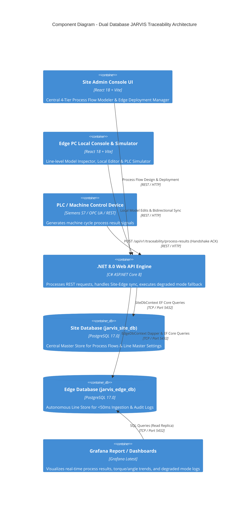
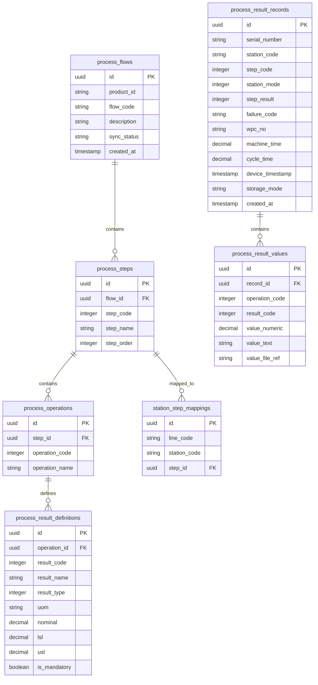

# System Architecture Specification: JARVIS Process Result Traceability

**System**: Valeo MOM System (JARVIS Process Result Traceability Recording)  
**Methodology**: AI SDLC Framework (Valeo MOM Standards & VIB July 2026)  
**Document Version**: 2.0 (Refined)  
**Lead Agent**: Architect Agent (Winston)  
**Date**: August 13, 2026  

---

## 1. Architectural Paradigm & System Overview

JARVIS Traceability is designed as an **Edge-Native Containerized Architecture with Dual-Database Sync (Site vs Edge), High-Speed Ingestion Engine (<50ms SLA), and Embedded Grafana Quality Analytics**.

It features:
1. **Site Admin Console UI**: Central management where Process Engineers design master Process Flows (`MATERIAL-1`, `FLOW1`), Process Steps (`11001`), Process Operations (`123021`), and Process Result Definitions (Nominal, LSL, USL, UOM), deploying them to assigned production line Edge PCs.
2. **Edge PC Local Console UI**: Line-level interface running on Edge PCs for local process model viewing/editing, PLC payload simulation, real-time result inspection, and degraded mode audit logging.
3. **Dual Database Architecture**:
   - **Site Central Database (`jarvis_site_db`)**: Master repository storing central process models, line configurations, and cross-line reports.
   - **Edge Line Database (`jarvis_edge_db`)**: Autonomous line-level store for sub-50ms PLC API calls and local line operations.
4. **.NET 8.0 Web API Engine**: High-throughput REST API processing PLC machine cycle calls under < 50ms SLA using non-blocking background channels (`Channel<T>`).
5. **PostgreSQL 17.0 Relational & Audit Database**: Stores relational metadata, process result records, and raw JSON payloads (`jsonb`) for zero-data-loss degraded mode recovery.
6. **Grafana Reporting Engine**: Pre-configured Grafana dashboards connected directly to PostgreSQL 17 to visualize part-level quality trends, torque/angle distribution, cycle times, and degraded mode logs.



---

## 2. Architectural Decisions (ADs)

### `AD-1`: **.NET 8.0 Web API Core Engine** `[ADOPTED]`
* **Binds**: Backend framework selection.
* **Prevents**: Technology fragmentation and latency bottlenecks during PLC API handshakes.
* **Rule**: Backend built with ASP.NET Core Web API on .NET 8.0. Uses EF Core 8.0 for BUC-0 metadata configuration and Dapper for ultra-fast BUC-1/BUC-2 process result array insertions.

### `AD-2`: **Dual Database Synchronization Pattern (Site DB vs Edge DB)** `[ADOPTED]`
* **Binds**: Multi-tier persistence architecture.
* **Prevents**: Central network dependency stalling line-level PLC manufacturing operations.
* **Rule**: Edge PC operates autonomously against `jarvis_edge_db`. Deploying from Site sets `sync_status = SYNCED`. Local Edge PC modifications set `sync_status = EDGE_MODIFIED` and synchronize back to `jarvis_site_db`.
* **Automated Background Sync Worker**: .NET 8 `SiteEdgeSyncBackgroundService` (`BackgroundService`) runs a non-blocking background polling loop every 30 seconds to reconcile `jarvis_site_db` and `jarvis_edge_db` automatically, flushing pending sync queues and updating status to `SYNCED` without requiring manual user intervention.

### `AD-3`: **Zero-Data-Loss Degraded Mode Engine** `[ADOPTED]`
* **Binds**: Payload validation and error recovery rules.
* **Prevents**: Data loss during PLC-Edge communication when context information is incomplete or unlinked.
* **Rule**: All received payloads MUST be persisted. If a station or step ID is missing/unregistered, store under fallback IDs with `storage_mode = DEGRADED_MISSING_CONTEXT` and log a raw JSON snapshot in `recording_audit_logs.raw_payload` (`jsonb`).

### `AD-4`: **Synchronous Latency Protection (< 50ms SLA)** `[ADOPTED]`
* **Binds**: API response pipeline.
* **Prevents**: Physical machine line cycle delays caused by software handshake waiting time.
* **Rule**: Database operations use pre-warmed connection pools and prepared batch statements. Telemetry logging is dispatched asynchronously via non-blocking background channel (`ChannelAuditLogger.cs`) so the HTTP response returns to the PLC within 50ms.

### `AD-5`: **ReactJS Site Admin Console & Edge PC Simulator UI** `[ADOPTED]`
* **Binds**: User interface architecture.
* **Prevents**: Separation between central process configuration and line-level operation.
* **Rule**: SPA built using React 18 with TypeScript providing:
  1. **Site Admin Console UI**: Central 4-tier process modeling (Flow ➔ Step ➔ Operation ➔ Result Definitions), station assignments, and "Deploy to Edge PC" action.
  2. **Edge PC Local UI**: Line-level process inspector, local flow editor, interactive PLC Handshake Simulator, and live database results/audit log viewer.

---

## 3. PostgreSQL 17 Database Schema (4-Tier Hierarchy & Ingestion)



---

## 4. API Endpoints & DTO Contracts

### 1. Ingestion Endpoint
- `POST /api/v1/traceability/process-results`
- Supports both **Nested VIB Format** (`product_context`, `process_context`, `time_context`, `process_results`) and **Flat API Format** (`ProductSerialNo`, `StationId`, `ProcessStepId`, `ProcessResults`).
- Response:
```json
{
  "status": "SUCCESS",
  "storage_mode": "STANDARD",
  "transaction_id": "tx_a1b2c3d4",
  "processed_at": "2026-08-13T22:25:00Z",
  "latency_ms": 12.4,
  "records_inserted": 2,
  "errors": []
}
```

### 2. Process Flow & Edge Sync Endpoints
- `GET /api/v1/process-flows`: Fetch all master process flows from `SiteDbContext`.
- `GET /api/v1/process-flows/edge`: Fetch active process flows on `EdgeDbContext`.
- `PUT /api/v1/process-flows/edge-edit/{flowId}`: Edit process model directly on Edge PC, update status to `EDGE_MODIFIED`, and sync back to `SiteDbContext`.

### 3. AI SDLC Workflow Orchestration API Endpoints
- `GET /api/v1/ai-sdlc/phases`: Returns live 6-phase metadata array with current gate statuses (`APPROVED`, `IN_REVIEW`, `PENDING`), assigned agents, token counts, and cost metrics.
- `GET /api/v1/ai-sdlc/artifacts/{filename}`: Streams raw markdown deliverables directly from server disk (`01_requirements_analyst_report.md` through `05_qa_reviewer_report.md`, `requirements.md`, `architecture.md`, `epics.md`, `AI_ENGINEERING_LOG.md`).
- `POST /api/v1/ai-sdlc/gates/{phaseNumber}/approve`: Approves specified phase gate, appends audit timestamp to `AI_ENGINEERING_LOG.md` on disk, transitions phase $N$ to `APPROVED`, and unlocks phase $N+1$ to `IN_REVIEW`.
- `POST /api/v1/ai-sdlc/reset-gates`: Resets stage-gate state back to Phase 01 (`IN_REVIEW`) for presentation and re-testing.

