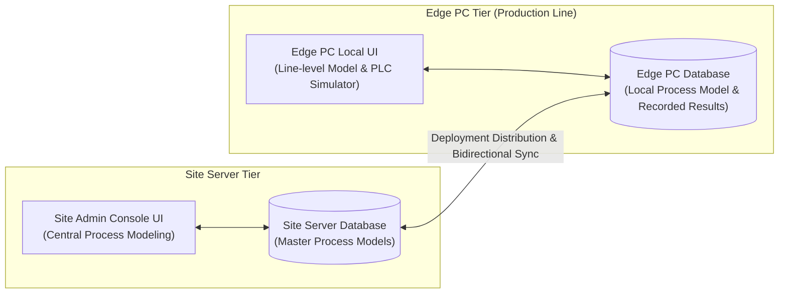

# BUC-0: Manufacturing Process Basic Modeling Schema & Site-to-Edge Sync

## Overview
BUC-0 defines the digital representation of manufacturing process flows inside the Valeo MOM (JARVIS) system. This model acts as the foundational support for process result recording, data quality control, and reporting context.

## Two-Tier UI & Synchronization Architecture



1. **Site Admin Console UI**:
   * Process Engineers create and manage master manufacturing process flows for Product References (`MATERIAL-1`, `FLOW1`).
   * Configures Process Steps, Process Operations, Result Definitions (Nominal, LSL, USL, UOM), and Station Mappings (`LINE-1`, `ST060.1`).
   * **Distribution Action**: Transfers the compiled process model to the target Edge PC of the assigned production line.

2. **Edge PC Local UI**:
   * Displays the active process model for the line.
   * Allows local viewing, editing, or fine-tuning directly at line level.
   * **Synchronization Action**: Local modifications on Edge PC are automatically synchronized back to the Site Server Database.

---

## Entity Model Hierarchy

```
Part Number (Product Reference)
 └── Manufacturing Process Flow (e.g., FLOW1)
      └── Process Step (e.g., [11001] Housing Screwing)
           ├── Station Assignment (e.g., ST060.1)
           └── Process Operation (e.g., [123021] Screw 1)
                └── Process Result Definition (e.g., [50032] Angle, [50033] Torque)
```

## Data Objects & Attributes

### 1. Process Flow
* `Flow_ID` (String): Unique identifier for the process flow (e.g., `FLOW1`).
* `Product_ID` / `Part_Number` (String): Associated material reference (e.g., `MATERIAL-1`).
* `Description` (String): Text description.
* `Sync_Status` (Enum): `SYNCED`, `PENDING_DEPLOYMENT`, `EDGE_MODIFIED`.

### 2. Process Step
* `ProcessStep_ID` (Integer): Step identifier (e.g., `11001`).
* `ProcessStep_Name` (String): Descriptive step name (e.g., `Housing Screwing`).
* `Order` (Integer): Sequence position within flow (`1`, `2`, `3`).

### 3. Station Assignment (`Link Process Step to Station`)
* `Line_ID` (String): Production line identifier (e.g., `LINE-1`).
* `Station_ID` (String): Physical station executing step (e.g., `ST060.1`, `ST060.2`).
* `ProcessStep_ID`: Link to assigned process step.

### 4. Process Operation
* `ProcessOperation_ID` (Integer): Operation identifier (e.g., `123021`).
* `ProcessOperation_Name` (String): Operation name (e.g., `Screw 1`).
* `ProcessStep_ID`: Parent process step link.

### 5. Process Result Definition
* `ProcessResult_ID` (Integer): Unique result ID (e.g., `50032`, `50033`).
* `ProcessResult_Name` (String): Measured variable (e.g., `Angle`, `Torque`, `TextrR`).
* `Type` (Enum): `1` = Numeric Decimal, `2` = Text String, `3` = File Reference (Image, XML, JSON, CSV).
* `UOM` (String): Unit of Measure (e.g., `DD` for degrees, `NU` for Newton-meters).
* `Nominal` (Decimal): Target nominal value.
* `LSL` (Decimal): Lower Specification Limit.
* `USL` (Decimal): Upper Specification Limit.
* `Mandatory` (Boolean): Whether result must be supplied during machine cycle.

---

## Sample Configuration Reference (Annex 1)

* **Product**: `MATERIAL-1` | **Flow**: `FLOW1`
* **Steps & Stations**:
  1. `11001` Housing Screwing $\rightarrow$ `ST060.1`, `ST060.2`
  2. `11002` Body Sub Assembly 1 $\rightarrow$ `ST070`
  3. `11003` Body Sub Assembly 2 $\rightarrow$ `ST080`
  4. `11004` Assembly Gear $\rightarrow$ `ST100`
  5. `11005` Final Test $\rightarrow$ `ST110`
  6. `11006` Packing $\rightarrow$ `ST120`
* **Operations for Step 11001**:
  * `123021 Screw 1`: `50032 Angle` (Numeric DD, LSL 80, USL 100, Nominal 90), `50033 Torque` (Numeric NU, LSL 4.5, USL 5.5, Nominal 5)
  * `123022 Screw 2`: `50039 Angle`, `50040 Torque`
  * `123023 Screw 3`: `50125 Angle`, `50126 Torque`
  * `123024 Screw 4`: `50127 Angle`, `50128 Torque`, `50129 TextrR` (Text, Mandatory No)
